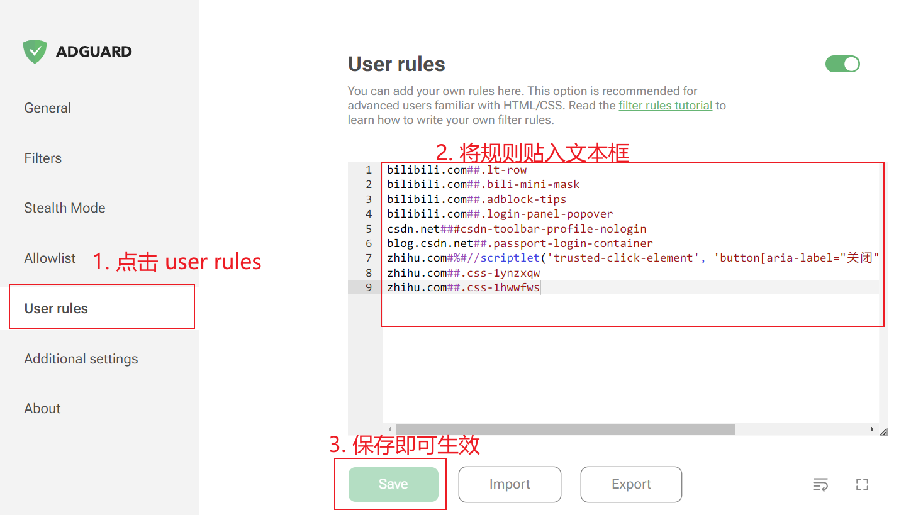
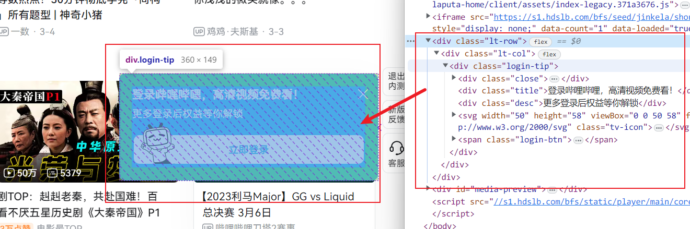

# 说明

网站登陆提示弹窗的过滤规则，用于屏蔽网站自动弹出的登陆提示窗口。

支持网站：
- B 站
- 知乎
- csdn

## 内容

过滤规则如下：

```
bilibili.com##.lt-row
bilibili.com##.bili-mini-mask
bilibili.com##.adblock-tips
bilibili.com##.login-panel-popover
csdn.net###csdn-toolbar-profile-nologin
blog.csdn.net##.passport-login-container
zhihu.com#%#//scriptlet('trusted-click-element', 'button[aria-label="关闭"][type="button"]', '', '50')[type="button"]', '', '50')
zhihu.com##.css-1ynzxqw
zhihu.com##.css-1hwwfws
```

## 使用

### 1. 安装屏蔽广告插件

如 `AdGuard`, `AdBlock Plus`

### 2. 将过滤规则添加到插件中



以 `AdGuard` 为例：
  1. 打开插件的配置界面
  2. 进入 User rules 配置项
  3. 将过滤规则文本添加到文本框，保存即可生效

## 自定义过滤规则

隐藏弹窗的思路是选中弹窗 html 元素，然后隐藏或删除该元素。

常用广告过滤插件的过滤规则语法都类似，为 `<domains><separator><body>`，如：`bilibili.com##.lt-row`，表示找到 `bilibili.com` 域名下所有网页中类名为 `.lt-row` 的元素，并隐藏。`##` 符号表示隐藏元素的操作。

这条规则加入后，就能隐藏 B 站右下角的固定登陆提示窗口：



其他网站的登陆窗口屏蔽也是类似。有的网站的网页内容要点击弹窗的关闭按钮后才会动态显示（知乎），所以要模拟点击“关闭”按钮的操作，这是上面的规则就不够用，需要执行一段脚本才行，插件不允许用户编写自定义脚本，只能使用插件提供的函数。对于 `AdGuard` 来说，叫 []`Scriptlet`](https://adguard.com/kb/zh-CN/general/ad-filtering/create-own-filters/#scriptlets)，对于 `AdBlock Plus` 来说叫 [snippet](https://help.adblockplus.org/hc/en-us/articles/1500002338501)。

上面的过滤规则中的：

> `zhihu.com#%#//scriptlet('trusted-click-element', 'button[aria-label="关闭"][type="button"]', '', '50')[type="button"]', '', '50')`

就是调用了 `AdGuard` 插件提供的 `trusted-click-element` 函数，模拟点击知乎网站上的登陆弹窗的关闭按钮的实现。

要注意，这些函数不一定在各插件中通用，这个 `trusted-click-element` 就只在 `AdGuard` 可用，如果要用到 `AdBlock Plus`，就要找它提供的类似函数。

### 过滤规则编写语法

[1. AdGuard 插件的自定义过滤规则指南](https://adguard.com/kb/zh-CN/general/ad-filtering/create-own-filters)

[2. AdBlock Plus 插件的自定义过滤规则指南](https://help.adblockplus.org/hc/en-us/articles/360062733293)

## chrome extension 开发备注（内容已废弃）

此项目一开始是一个过滤登陆弹窗的独立插件，后来发现常用的广告过滤插件支持自定义过滤规则，只需按规则写过滤条件，就能实现之前用 JS DOM 操作一样的效果，并且后续增加方便。所以不再以独立插件的方式增加功能。以下内容已归档。

这个扩展目前执行脚本的方式叫[content_scripts](https://developer.chrome.com/docs/extensions/mv3/content_scripts/)，这种方式运行的脚本可通过 DOM 接口读取、修改页面内容，脚本的执行时机默认是 window 的 `load` 事件触发以后，即脚本会在整个页面及外部的样式表、图片都加载完成以后自动执行。

[content_scripts] 的选项在 `manifest.json` 中配置，可配哪些选项参考官方文档。

### 参考文档

- [谷歌浏览器扩展开发的概览](https://developer.chrome.com/docs/extensions/mv3/devguide/)

- 插件在本地使用的方式：[本地加载未打包的扩展](https://developer.chrome.com/docs/extensions/mv3/getstarted/development-basics/#load-unpacked)，目前采用这种方式自用。

- [将插件发布到 Chrome Store 的教程](https://developer.chrome.com/docs/webstore/publish/)
